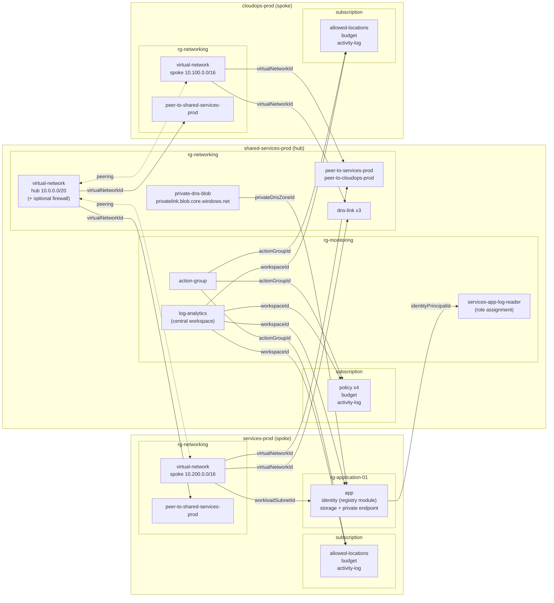

# Nitra Sample Project

A hub and spoke Azure platform across three subscriptions, deployed with [Nitra](https://github.com/NathanKewley/Nirta). It is built to show Nitra's cross-subscription deploys: configurations in one subscription take outputs from deployments in another with `Ref:`, and Nitra works out the order across subscriptions for you.

Everything deployed is free or close to it, a deploy and destroy test costs well under $0.50, see [Cost](#cost).

## Architecture



Solid arrows are `Ref:` outputs, pointing from the deployment that makes the output to the configuration that uses it. Most of them cross subscription boundaries, in both directions: the hub uses spoke outputs (VNet ids for peering and DNS links, the app identity for a role assignment), and the spokes use hub outputs (workspace, action group, DNS zone).

## What it shows

| Nitra feature | Where |
|---|---|
| Cross-subscription `Ref:` | `services-prod/rg-application-01/app.yaml` uses a hub workspace and DNS zone, `shared-services-prod/rg-monitoring/services-app-log-reader.yaml` uses the spoke app's identity |
| Deploy order across subscriptions | `nitra deploy-resource-group services-prod/rg-application-01` first deploys the spoke VNet, then the hub workspace and DNS zone it depends on |
| `redeploy_as_dependency: false` | `log-analytics.yaml`, `action-group.yaml` and `private-dns-blob.yaml` in the hub, referenced by many configurations but only deployed when missing |
| `scope: subscription` | The `subscription/` folder in every subscription: policy, budget, and Activity Log sent to the hub workspace |
| One template, many configurations | `network/spoke.bicep`, `network/peering.bicep`, `network/privateDnsZoneLink.bicep` and the `subscription/` templates are each used by several configurations |
| Local Bicep modules | `bicep/modules/` holds building blocks that no configuration deploys directly. `networkSecurityGroup.bicep` is used by both `network/hub.bicep` and `network/spoke.bicep`. `storageAccount.bicep` and `privateEndpoint.bicep` are used by `workload/app.bicep` |
| Public registry module | `workload/app.bicep` creates its managed identity with the [Azure Verified Module](https://aka.ms/avm) `br/public:avm/res/managed-identity/user-assigned-identity`, pinned to a version |
| Native YAML types | Arrays (`addressPrefixes`, `allowedLocations`, `contactEmails`), bools (peering, `deployFirewall`), ints (`amount`, `retentionInDays`) and objects (`tags`) |
| Hooks | `scripts/sample_python_hook.py` (hub VNet) prints the `NITRA_*` variables. `scripts/sample_bash_hook.sh` (app) runs a read-only `az` command, which already targets the app's subscription |

## Layout

```
bicep/
  modules/         building blocks used by the templates below, never deployed directly
  network/         hub, spoke, peering, private DNS zone and links
  monitoring/      Log Analytics workspace, action group, role assignment
  subscription/    policy, budget, Activity Log (targetScope = 'subscription')
  workload/        app: identity, storage account and private endpoint
configuration/
  shared-services-prod/   subscription/, rg-monitoring/, rg-networking/
  services-prod/          subscription/, rg-networking/, rg-application-01/
  cloudops-prod/          subscription/, rg-networking/
scripts/                  hooks
```

The `subscription` folders only hold `scope: subscription` configurations, no resource group is created for them. Their `location.yaml` sets where the deployment metadata is stored.

## Requirements

* Three subscriptions named `shared-services-prod`, `services-prod` and `cloudops-prod` in one tenant (rename the folders under `configuration/` to match yours)
* Owner, or Contributor plus User Access Administrator, on all three. The app and hub create role assignments
* Subscriptions that support Consumption budgets, e.g. Pay-As-You-Go, EA or MCA
* [Nitra](https://github.com/NathanKewley/Nirta), the Azure CLI and Bicep

## Validate

`nitra validate` checks every configuration and template without an Azure login, it runs on every pull request via `.github/workflows/validate.yaml`.

```
nitra validate
... - INFO - Validation passed: 27 configuration(s), 13 template(s)
```

## Plan

Login with `az login`, then from the root of this repo run `nitra plan`. It previews what a deploy would change without changing anything. On a first run most configurations take a `Ref:` from a stack that isn't deployed yet, so they are listed as not able to be previewed.

## Deploy

`nitra deploy-account` deploys everything, it takes about 25 minutes. Or deploy part of it and let Nitra pull in the dependencies:

* `nitra deploy-subscription services-prod`
* `nitra deploy-resource-group services-prod/rg-application-01`
* `nitra deploy shared-services-prod/rg-monitoring/services-app-log-reader.yaml`

## Destroy

`nitra destroy-account` lists every stack it will destroy, in order, and asks you to type `yes`. It destroys in reverse dependency order across subscriptions, e.g. the hub role assignment before the spoke app identity it refers to. Resource groups are left in place, empty resource groups cost nothing. A full destroy is slower than the deploy, about 85 minutes, as each stack is deleted one at a time and private DNS links take around 5 minutes each.

After a destroy, the Log Analytics workspace is soft-deleted for 14 days. Deploying again within that time recovers it.

## Cost

| Resource | Cost |
|---|---|
| VNets, subnets, NSGs, managed identity, role assignments, policy assignments, budgets, action group, diagnostic settings, deployment stacks | Free |
| VNet peering | Per GB transferred, nothing here |
| Storage account (Standard_LRS, empty) | Under $0.01 |
| Private endpoint | About $0.01 an hour |
| Private DNS zone | $0.50 a month per zone, a partial month may be charged in full |
| Log Analytics | Activity Log data is free to ingest, other ingestion is capped at 0.1 GB a day with 30 days retention |
| Azure Firewall | Off (`deployFirewall: false`), about $1.25 an hour if turned on |

A deploy and destroy within an hour costs a few cents, or up to about $0.50 if the DNS zone is charged for the full month. Each subscription also gets a $5 monthly budget with an alert at 80%.

The action group and budgets email `noemail@noemail.com`, a placeholder. Change it in `configuration/shared-services-prod/rg-monitoring/action-group.yaml` and the `budget.yaml` files to get the alerts.

## Not used yet

`bicep/management-groups/` is for a possible future enhancement, Nitra does not deploy at management group scope.
